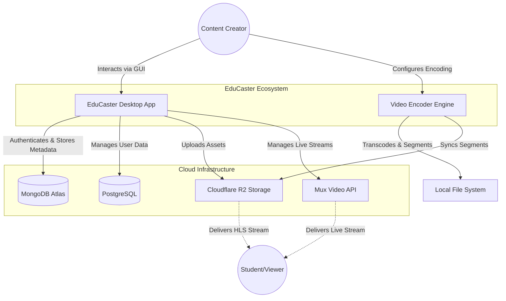
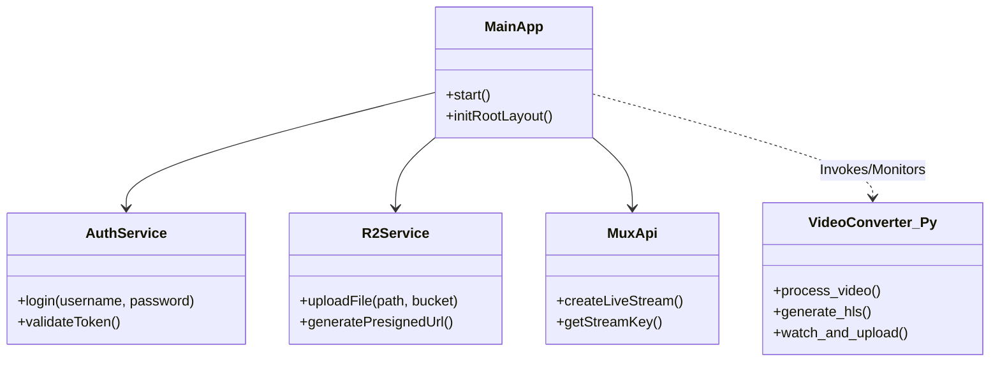
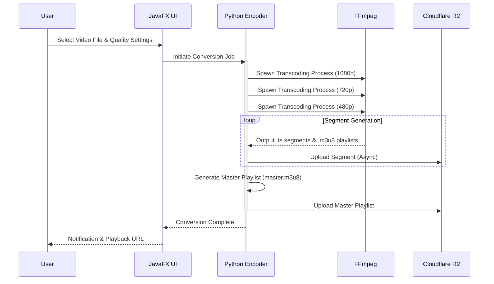

# EduCaster System Design Document

## 1. Executive Summary
**EduCaster** is a professional-grade desktop application engineered for educational content creators and institutions. It facilitates the seamless management, encoding, and distribution of high-quality video content. By integrating advanced video processing capabilities (FFmpeg) with scalable cloud infrastructure (Cloudflare R2, Mux), EduCaster provides an end-to-end solution for Video-on-Demand (VOD) and live streaming workflows.

## 2. System Architecture

The system adopts a **Hybrid Desktop Architecture**, combining the robustness of Java (Spring Boot/JavaFX) for application logic and UI with the performance of Python for media processing.

### 2.1 System Context Diagram (C4 Level 1)



## 3. Component Design

The application is structured into distinct functional modules to ensure separation of concerns and maintainability.

### 3.1 Container Diagram



### 3.2 Core Modules

#### **Java Backend (Application Core)**
- **`com.educater.ui`**: Manages the JavaFX-based user interface, including Login, Dashboard, and Settings windows.
- **`com.educater.auth`**: Handles secure user authentication using hashed credentials and session management.
- **`com.educater.r2`**: Implements the AWS SDK v2 to interact with Cloudflare R2 (S3-compatible) for object storage operations.
- **`com.educater.mux`**: Interfaces with the Mux API to provision and manage live streaming endpoints.
- **`com.educater.db`**: Abstraction layer for database operations, supporting both MongoDB (document store) and PostgreSQL (relational).

#### **Python Video Engine (Media Processing)**
- **`convert.py`**: A high-performance wrapper around FFmpeg.
  - **Adaptive Bitrate Streaming (ABR)**: Generates multi-variant HLS playlists (1080p, 720p, 480p, 360p).
  - **Concurrency**: Utilizes `concurrent.futures` for parallel transcoding of different quality layers.
  - **Hardware Acceleration**: Supports NVIDIA NVENC for GPU-accelerated encoding.
  - **Watchdog Integration**: Monitors file system events to perform real-time uploads of HLS segments to Cloudflare R2.

## 4. Data Flow Architecture

### 4.1 Video On-Demand (VOD) Processing Pipeline

This sequence illustrates the transformation of a raw video file into a stream-ready HLS asset.



## 5. Technology Stack & Dependencies

| Category | Technology | Purpose |
|----------|------------|---------|
| **Languages** | Java 17+, Python 3.9+ | Core logic and scripting |
| **UI Framework** | JavaFX / OpenJFX 23 | Cross-platform desktop GUI |
| **Build Tool** | Maven | Dependency management and build lifecycle |
| **Cloud Storage** | Cloudflare R2 (via AWS SDK v2) | Low-latency, egress-free object storage |
| **Video Processing** | FFmpeg | Industry-standard multimedia framework |
| **Streaming** | Mux | Developer-first API for live streaming |
| **Database** | MongoDB, PostgreSQL | Hybrid data persistence strategy |
| **Python Libs** | `boto3`, `watchdog` | S3 interactions and file system monitoring |

## 6. Directory Structure Overview

```
d:\Major Project\BR31Demo\Educater
├── src/main/java/com/educater   # Java Source Code
│   ├── auth/                    # Authentication Logic
│   ├── config/                  # Application Configuration
│   ├── db/                      # Database Connectors
│   ├── model/                   # Data Models (POJOs)
│   ├── mux/                     # Mux API Integration
│   ├── net/                     # Network Utilities
│   ├── r2/                      # R2 Storage Service
│   └── ui/                      # JavaFX User Interface
├── videoEncoder/                # Python Video Processing Engine
│   ├── convert.py               # Main Transcoding Script
│   ├── r2_config.json           # Cloud Credentials
│   └── ffmpeg_bin/              # Embedded FFmpeg Binaries
├── pom.xml                      # Maven Project Configuration
└── SYSTEM_DESIGN.md             # This Document
```

## 7. Security & Deployment

- **Credential Management**: Sensitive keys (AWS/R2 credentials) are managed via configuration files (`r2_config.json`) or environment variables, keeping them separate from the codebase.
- **Dependency Management**: The Python engine includes a self-bootstrapping mechanism to download FFmpeg binaries if missing, ensuring a consistent runtime environment across Windows deployments.
- **Distribution**: The application is packaged as a shaded JAR (Fat JAR) encompassing all dependencies, with a separate Python environment requirement for the encoding engine.
