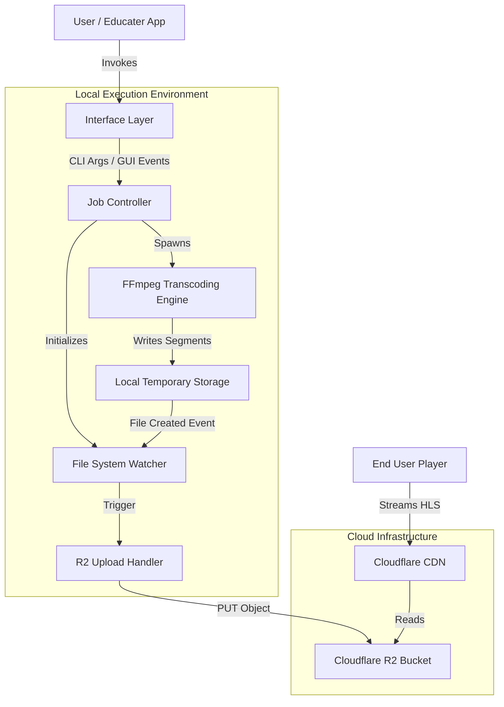
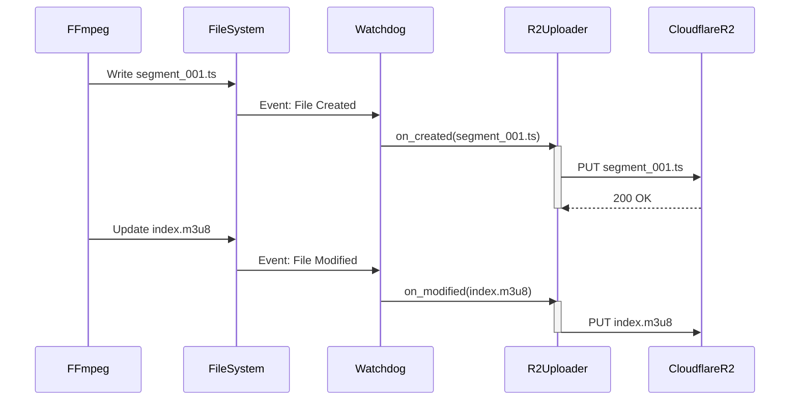
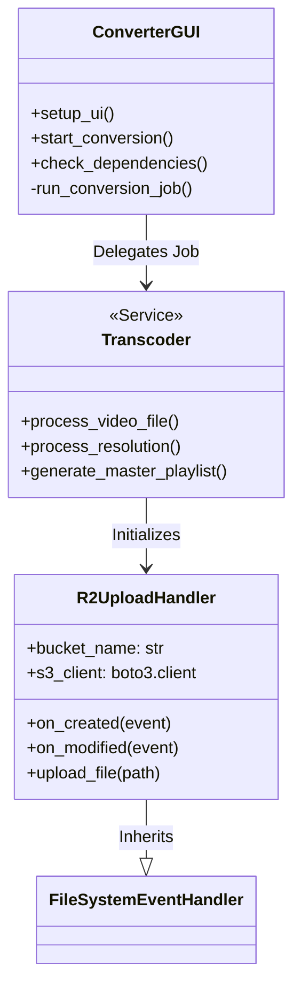

# EduCaster System Design Document

**Version:** 2.0.0  
**Date:** 2026-03-13  
**Author:** Engineering Team  
**Status:** Production Ready

---

## 1. Executive Summary

EduCaster is a high-performance, local video encoding engine designed to power the video infrastructure of the Educater platform. It solves the challenge of expensive cloud-based transcoding by leveraging local hardware resources (CPU/GPU) to convert high-bitrate source videos into Adaptive Bitrate (ABR) HLS streams. 

Crucially, it implements a "transcode-and-upload" pipeline that streams generated media segments directly to Cloudflare R2 object storage in real-time, minimizing local storage requirements and latency.

## 2. System Architecture

The system follows a modular event-driven architecture, separating the User Interface, Transcoding Engine, and Storage Gateway.

### 2.1 High-Level Architecture

### 2.2 Core Modules

| Module | Responsibility | Key Technologies |
|--------|----------------|------------------|
| **Interface Layer** | Accepts user inputs via CLI or GUI (Tkinter). Validates configurations and dependencies. | `argparse`, `tkinter` |
| **Job Controller** | Orchestrates the transcoding process. Manages thread pools for parallel resolution processing. | `concurrent.futures`, `threading` |
| **Transcoding Engine** | Wraps FFmpeg binaries to perform actual video encoding. Handles hardware acceleration (NVENC) and bitrate control. | `subprocess`, `ffmpeg` |
| **Storage Gateway** | Monitors file system events to detect new HLS segments and uploads them immediately to the cloud. | `watchdog`, `boto3` |

---

## 3. Detailed Component Design

### 3.1 Transcoding Strategy (Adaptive HLS)

The system generates a variant stream for each target resolution to ensure smooth playback across different network conditions.

| Quality | Resolution | Video Bitrate | Audio Bitrate |
|:-------:|:----------:|:-------------:|:-------------:|
| **1080p** | 1920x1080 | 5000 kbps | 192 kbps |
| **720p** | 1280x720 | 2800 kbps | 128 kbps |
| **480p** | 854x480 | 1400 kbps | 128 kbps |
| **360p** | 640x360 | 800 kbps | 96 kbps |
| **240p** | 426x240 | 400 kbps | 64 kbps |

**Key Optimization:**
- **Parallel Processing:** Uses `ThreadPoolExecutor` to encode multiple resolutions simultaneously, saturating available CPU/GPU cores.
- **Hardware Acceleration:** Auto-detects and utilizes NVIDIA NVENC (`h264_nvenc`) for up to 10x faster encoding.

### 3.2 Real-time Upload Pipeline (The "Watcher" Pattern)

Instead of waiting for the entire video to finish encoding, the system uses a reactive pattern.

---

## 4. Class & Data Structure Design

The application logic is structured around the `ConverterGUI` for state management and standalone functions for processing logic to maintain CLI compatibility.

---

## 5. Technical Decisions & Trade-offs

### 5.1 Python vs. Go/Rust
*   **Decision:** Python was chosen for rapid development and rich ecosystem (`boto3`, `tkinter`).
*   **Trade-off:** Python's GIL is a bottleneck for CPU-bound tasks.
*   **Mitigation:** The heavy lifting (encoding) is offloaded to the FFmpeg subprocess, which runs outside the GIL. Threading is used only for I/O (uploading) and process management.

### 5.2 Local vs. Cloud Transcoding
*   **Decision:** Local transcoding on the content creator's machine.
*   **Rationale:** Cloud transcoding (e.g., AWS MediaConvert) is expensive ($0.0075/min per resolution). For an educational platform with thousands of hours of content, local encoding reduces infrastructure costs to near zero.

### 5.3 Watchdog vs. Polling
*   **Decision:** `watchdog` library for file system events.
*   **Rationale:** Polling is inefficient and introduces latency. Event-driven upload ensures segments are available in the cloud milliseconds after generation.

---

## 6. Scalability & Performance

### 6.1 Parallel Resolution Encoding
The system scales vertically with the user's hardware.
*   **Single Core:** Sequential processing (Safe fallback).
*   **Multi Core:** Parallel processing of 5 resolutions.
*   **GPU:** NVENC offloads CPU, allowing the system to remain responsive during encoding.

### 6.2 Network Resilience
*   The `R2UploadHandler` uses a thread-safe set (`uploaded_files`) to prevent duplicate uploads.
*   Retry logic is handled implicitly by `boto3` for transient network errors.

---

## 7. Future Improvements

1.  **Resume Capability:** Implementation of a checkpoint system to resume interrupted encodings.
2.  **Dash Support:** Adding support for MPEG-DASH alongside HLS.
3.  **Watermarking:** FFmpeg filter complex to add dynamic watermarks during transcoding.
4.  **Presigned URLs:** Secure upload mechanism to remove the need for hardcoded credentials in `r2_config.json`.
